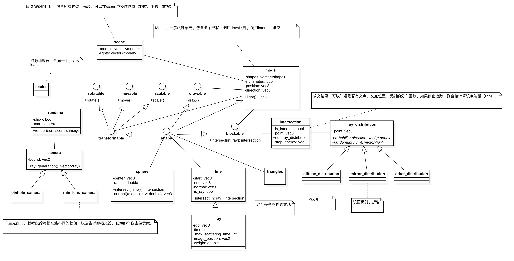

# 图形绘制技术Project (Option 1)

*151220129* 吴政亿

*151220114* 王宇鑫

## 项目背景

### 三维图形绘制的基本概念

### 几何模型

### 光源模型

### 相机模型

#### 小孔成像

#### 薄透镜

### 材质模型

### 对比分析四种常用光照算法

#### 光线投射

#### 光线跟踪

#### 分布式光线跟踪

#### 路径跟踪

### 实验目的

探究以物理为基础的真实绘制---主要是光线的能量追踪，所带来的优势和劣势。

## 系统分析与设计

### 模块分解图

类图：

### 光照算法

> 算法流程图/伪代码

## 系统实现

### 开发与运行环境

1. QT5.12.2
1. opengl
1. c++17
1. win/mac

### 重要模块/算法实现细节

#### renderer

渲染主要流程。

#### camera

相机光线生成

#### ray_distribution

次生光线生成。

#### serilization

序列化。

## 效果演示

> 对演示图截图并分析光纤能量分布情况。通过调整几何、光源、相机以及材质等参数，记录场景中光线的分布变化情况，与理论分析相对应，总结规律。

## 总结与展望

> 碰到的问题与解决方案
>
> 未解决的问题给出可能的解决方案

## 参考资料

