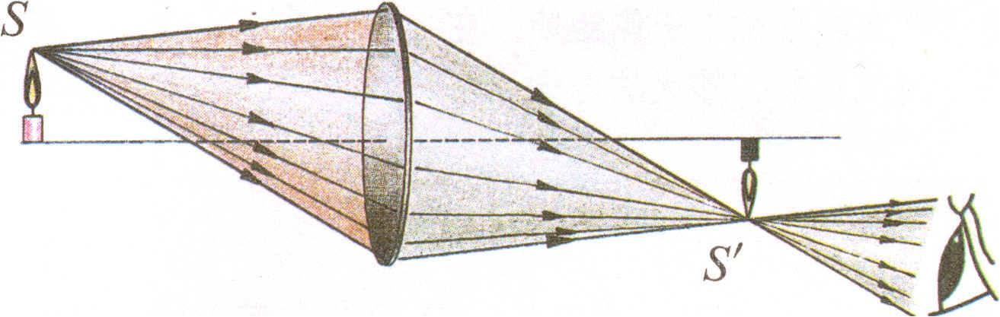
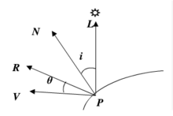
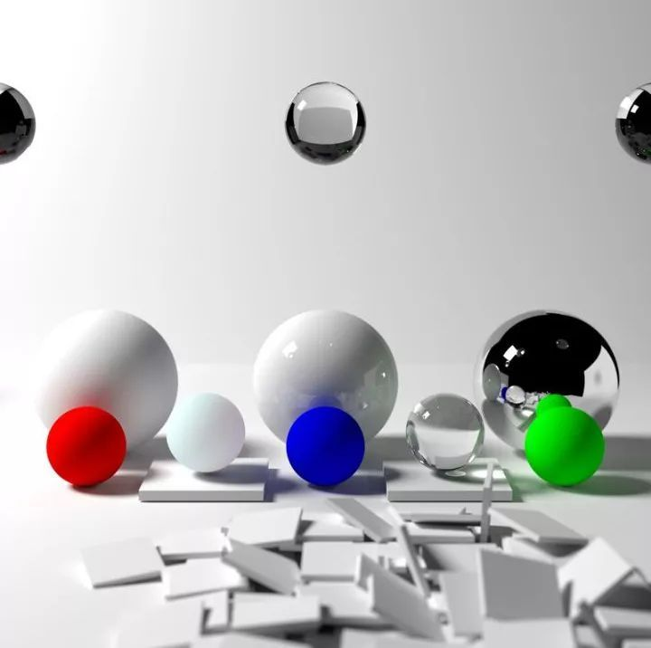

# 图形绘制技术Project (Option 1)

*151220129* 吴政亿

*151220114* 王宇鑫

## 项目背景

### 三维图形绘制的基本概念

**三维计算机图形**（英语：*3D computer graphics*）是[电子计算机](https://zh.wikipedia.org/wiki/電子計算機)和特殊三维[软件](https://zh.wikipedia.org/wiki/软件)帮助下创造的作品。一般来讲，该术语可指代创造这些图形的过程，或者三维计算机图形技术的研究领域，及其相关技术。

三维计算机图形和[二维计算机图形](https://zh.wikipedia.org/wiki/二维计算机图形)的不同之处在于计算机内存储存了几何数据的三维表示，用于计算和绘制最终的二维图像。

创建三维计算机图形的过程可以顺序分为三个基本阶段：

- [建模](https://zh.wikipedia.org/wiki/建模)
- 场景布局和动画
- 绘制

建模过程可能也包括编辑物体表面或材料性质（例如，颜色，荧光度，漫射和镜面反射分量—经常被叫做粗糙度和光洁度，反射特性，透明度或不透明度，或者折射指数），增加纹理，凹凸映射和其它特征。

把物体的表示（例如[球面](https://zh.wikipedia.org/wiki/球面)的中[点](https://zh.wikipedia.org/wiki/点)[坐标](https://zh.wikipedia.org/wiki/坐标)和它的[表面](https://zh.wikipedia.org/wiki/表面)上的一个点所表示的球面），转换到一个（球面的）多边形表示的过程，称为*剖分（tesselation）*。该步骤用于基于多边形的绘制，其中对象从象球面，[圆锥面](https://zh.wikipedia.org/w/index.php?title=圆锥面&action=edit&redlink=1)等等这样的抽象的表示（“体素”），分解成为所谓“网格”，它是互相连接的三角形的网络。

三角网格（而不是[正方形](https://zh.wikipedia.org/wiki/正方形)等形状）比较流行，因为它们易于采用[扫描线绘制](https://zh.wikipedia.org/w/index.php?title=扫描线绘制&action=edit&redlink=1)进行绘制。

多边形表示不是所有绘制技术都必须的，而在这些情况下，从抽象表示到绘制出的场景的转换不包括剖分步骤。

在渲染成[图象](https://zh.wikipedia.org/wiki/图象)之前，模型必须放置在一个[场景](https://zh.wikipedia.org/w/index.php?title=场景&action=edit&redlink=1)中。这定义了模型的位置和大小。

场景设置涉及安排一个场景内的虚拟物体，灯光，摄像机和其他实体，它将被用于制作一幅静态画面或一段动画。

照明是场景布置中一个重要的方面。就象在实际场景布置的时候一样，光照是最终作品的审美和视觉质量的关键因素之一。因而，它是一项很难掌握的艺术。光照因素可以对一个场景的氛围和情绪反映作出重大贡献，这是为摄影师和舞台照明师所熟悉的事实。

[渲染](https://zh.wikipedia.org/wiki/渲染)是从准备的场景创建实际的二维景象或动画的最后阶段。这可以和现实世界中在布景完成后的照相或摄制场景的过程相比。

用于诸如游戏或模拟程序这样的交互式媒体的渲染需要实时计算和显示，速度约为20到120帧每秒。非交互式媒体（譬如录象或电影），渲染的慢得多。非实时渲染使得有限的计算能力得以放大以获得高质量的画面。复杂场景的单帧的渲染速度可能从几秒到一个小时或者更多。渲染完成的帧存贮在硬盘，然后可能转录到其它媒介，例如电影胶卷或者光盘。然后这些帧以高帧率播放，通常为24，25，或30帧每秒，以达成运动的假象。

最后的作品经常会需要达到真实感图形质量，要达到这个目的，很多不同和专门的渲染技术被发展出来。这些技术的范围包括相当非真实感的[线框模型](https://zh.wikipedia.org/wiki/线框模型)渲染技术，到基于多边形的渲染，到更高级的技术，例如：[扫描线渲染](https://zh.wikipedia.org/wiki/扫描线渲染)、[光线跟踪](https://zh.wikipedia.org/wiki/光线跟踪)或者[辐射着色](https://zh.wikipedia.org/wiki/辐射着色)。

渲染软件可以模拟例如[镜头光晕](https://zh.wikipedia.org/w/index.php?title=镜头光晕&action=edit&redlink=1)、[景深](https://zh.wikipedia.org/wiki/景深)或者[运动模糊](https://zh.wikipedia.org/wiki/运动模糊)这样的视觉效果。这些技术试图模拟镜头和人眼的光学特性所造成的视觉现象。这些技术可以增加场景的真实程度，虽然该效果可能只是镜头的人造模拟现象。

为模拟其他自然发生的效应的各种技术被发展出来，例如光和不同形式的物质的相互作用。这些技术的例子包括[粒子系统](https://zh.wikipedia.org/wiki/粒子系统)（它可以模拟雨，烟，或者火），[体采样](https://zh.wikipedia.org/w/index.php?title=体采样&action=edit&redlink=1)（用于模拟雾，尘或者其它空间大气效果），[焦散效果](https://zh.wikipedia.org/w/index.php?title=焦散效果&action=edit&redlink=1)（用于模拟光被不均匀折射性质的表面所聚焦的现象，例如游泳池底部的光的涟漪），还有[次表面散射](https://zh.wikipedia.org/wiki/次表面散射)（subsurface scattering，用于模拟光在人的皮肤这样的实体对象内部反射的现象）。

现代三维计算机图形严重的依赖于一个简化的反射模型称为*Phong反射模型*，它和[Phong明暗图](https://zh.wikipedia.org/w/index.php?title=Phong明暗图&action=edit&redlink=1)是完全不同的主题，不能混淆二者。


### 几何模型

#### 球（Shpere）


| 变量名           | 意义                                                         |
| ---------------- | ------------------------------------------------------------ |
| glm::vec3 center | 球的中心点在世界坐标系的三维坐标                             |
| float radius     | 球的半径                                                     |
| int m            | 在z轴上的切片步数，越大则球在z轴越光滑，但是会增加绘制复杂度 |
| int n            | 在x轴和y轴上的切片步数，越大则球在x轴和y轴越光滑，但是会增加绘制复杂度 |


| 函数名    | 功能                                                         |
| --------- | ------------------------------------------------------------ |
| draw      | 根据参数center、radius、m、n绘制球体                         |
| intersect | 根据传入参数光线与球求交点，返回交点的位置                   |
| apply     | 根据传入的四维矩阵，对球进行旋转、平移、放缩变换             |
| normal    | 根据传入的点的坐标（已知点在物体表面），返回该点所在的法向量 |
| inside    | 根据传入的点的坐标，判断点是否在球内                         |


#### 立方体（Cube）


| 变量名                           | 意义                                              |
| -------------------------------- | ------------------------------------------------- |
| glm::vec3 axis_x, axis_y, axis_z | 立方体的延展方向，分别为x轴、y轴、z轴                  |
| glm::vec3 extend                 | 立方体在x轴、y轴、z轴方向上的延展长度                                         |
| glm::vec3 center                 | 立方体的中心点在世界坐标系的三维坐标              |
| glm::vec3 vertex[8]              | 立方体的八个顶点在立方体坐标系的三维坐标          |
| glm::mat4 T                      | 坐标变换矩阵，世界坐标系坐标*T = 立方体坐标系坐标 |


| 函数名         | 功能                                                         |
| -------------- | ------------------------------------------------------------ |
| draw           | 根据参数vertex[8]绘制球体                                    |
| intersect      | 根据传入参数光线与立方体求交点，返回交点的位置               |
| apply          | 根据传入的四维矩阵，对立方体进行旋转、平移、放缩变换         |
| normal         | 根据传入的点的坐标（已知点在物体表面），返回该点所在的法向量 |
| inside         | 根据传入的点的坐标，判断点是否在立方体内                         |
| init_vertex    | 根据参数axis_x,axis_y,axis_z,extend,center初始化vertex[8]    |
| init_T         | 根据参数vertex[8]计算坐标变换矩阵                            |
| plane          | 根据平面上一点以及平面的法向量，得到平面方程，并与传入参数射线求交点 |
| point_in_plane | 传入四个点abcd（构成一个矩形）和一个点x，判断点是否在围成点矩形中 |


#### 光线（Ray）


| 变量名                    | 意义                                                         |
| ------------------------- | ------------------------------------------------------------ |
| glm::vec3 rgb             | 光线的颜色/能量                             |
| float weight              | 光线的权重                                                   |
| unsigned time;            | 光线的存活时间 |
| std::vector<ray *> childs | 当前光的子光线 |


| 函数名    | 功能                                 |
| --------- | ------------------------------------ |
| direction | 返回光线的方向 |
| is_inside | 判断光线是否在物体内部               |


### 光源模型

在实现中，我们设置的光源模型是一个肉色的立方体，它向它的四周发射等量的光源。

### 相机模型

#### 小孔成像


小孔成像模型是相机成像采用最多的模型。在此模型下，物体的空间坐标和图像坐标之间是线性的关系，因而对相机参数的求解就归结到求解线性方程组上。四个坐标系的关系图如下图所示，其中 M 为三维空间点，m 为 M 在图像平面投影成的像点。

#### 薄透镜



薄透镜，在光学中，是指透镜的厚度（穿过光轴的两个镜子表面的距离）与焦距的长度比较时，可以被忽略不计的透镜。厚度不能被忽略的透镜称为厚透镜。

由于焦距决定了成像平面，因此引发了对焦与景深等概念。

### 材质模型

#### 漫反射

漫反射（简称漫射，英语diffuse reflection）是光线照射在物体粗糙的表面会无序地向四周反射的现象。 漫反射，是投射在粗糙表面上的光向各个方向反射的现象。当一束平行的入射光线射到粗糙的表面时，表面会把光线向着四面八方反射，所以入射线虽然互相平行，由于各点的法线方向不一致，造成反射光线向不同的方向无规则地反射，这种反射称之为“漫反射”或“ 漫射 ”。这种反射的光称为漫射光。很多物体，如植物、墙壁、衣服等，其表面粗看起来似乎是平滑，但用放大镜仔细观察，就会看到其表面是凹凸不平的，所以本来是平行的太阳光被这些表面反射后，弥漫地射向不同方向。

由于物体通常表面凹凸不平，因此漫反射是大自然中最普遍的表面反射方式。这种无方向性的反射可以从反射面同侧的任何角度观测到亮度减弱的入射光。

当一束平行光触及光滑物体表面时，光线则发生规律性反射，反射后的光线也相互平行，这种规律性反射称为光的单向反射或镜面反射。但物体的光滑程度是相对的，而一般物体的表面多粗糙不平，入射线虽然为平行光线，但反射后的光线则向各个方向分散，此种现象为光的漫反射。

漫反射的每条光线均遵循反射定律。平行光束经漫反射后不再是平行光束。由漫反射形成的物体亮度，一般视光源强度和反射面性质而定。

积分球（integrating sphere），是具有高反射性内表面的空心球体。用来对处于球内或放在球外并靠近某个窗口处的试样对光的散射或发射进行收集的一种高效率器件。球上的小窗口可以让光进入并与检测器靠得较近。积分球基本的特征就是光学中最通用仪器的一种，光能的应用在各方面都在增多。例如纤维光学、激光技术、照相化学和医学技术积分球在这些领域都获得了广泛的应用，并正在改进和取代那些结构复杂、价格昂贵的光学系统。由于积分球内表面具有超高反射和散射的特性，所以它具有独特的接收发射光的性能。光在均匀分布的球壁作无规则的反射，使能量可以作准确地测量，正由于积分球有此特性，改变它的窗口位置及几何结构，就可以获得各种不同的应用。

#### 镜面反射

镜面反射，也被称为正反射，是镜面状反射的波，诸如光，从表面。在该过程中，每个入射光线以与入射光线相同的角度反射到表面法线，但是在由入射和反射光线形成的平面中的表面法线的相对侧上反射。结果是由表面反射的图像以镜像（镜面）方式再现。

的反射定律指出为每个入射光线的入射角等于反射角，和入射，法线和反射方向是共面的。这种行为首先由亚历山大的英雄（公元 10-70）描述。它可以与漫反射形成对比，在漫反射中，光在一系列方向上而不是仅仅一个方向上从表面散射。

当光线照射到表面时，有三种可能的结果。的光可吸收由材料，光可透射通过表面，或光可以被反射。材料通常表现出这些行为的某种混合，每种材料的光的比例取决于材料的性质，光的波长和入射角。对于材料之间的大多数界面，反射的光的分数随着入射角的增加而增加。

反射光可分为两种子类型，即镜面反射和漫反射。镜面反射反射从给定方向以相同角度到达的所有光，而漫反射反射在宽范围方向上的光。镜面反射和漫反射之间区别的一个例子是光泽和哑光 涂料。哑光涂料几乎只有漫反射，而光泽涂料则具有镜面反射和漫反射。由非吸收性粉末（例如石膏）构建的表面可以是近乎完美的漫射器，而抛光的金属物体可以非常有效地镜面反射光。镜子的反射材料通常是铝或银。

### phong高光



镜面反射（高光），是光线经过物体表面，反射到视野中，当反射光线与人的眼睛看得方向平行时，强度最大，高光效果最明显，夹角为90度时，强度最小。

specular = I\*R\*V

- specular：反射光经过物体表面反射后进入人眼的光强；
- I：反射光的光强，Phong依然是理想模型，所以不考虑光的衰减，即反射光的光强和入射光的光强相等；
- R：反射光线的方向；
- V：视线的方向；

### 对比分析四种常用光照算法

#### 光线投射


光线投射（Ray Casting），作为光线追踪算法中的第一步，其理念起源于1968年，由Arthur Appel在一篇名为《 Some techniques for shading machine rendering of solids》的文章中提出。其具体思路是从每一个像素射出一条射线，然后找到最接近的物体挡住射线的路径，而视平面上每个像素的颜色取决于从可见光表面产生的亮度。


#### 光线跟踪


1979年，Turner Whitted在光线投射的基础上，加入光与物体表面的交互，让光线在物体表面沿着反射，折射以及散射方式上继续传播，直到与光源相交。这一方法后来也被称为经典光线跟踪方法、递归式光线追踪（Recursive Ray Tracing）方法，或 Whitted-style 光线跟踪方法。

光线追踪方法主要思想是从视点向成像平面上的像素发射光线，找到与该光线相交的最近物体的交点，如果该点处的表面是散射面，则计算光源直接照射该点产生的颜色；如果该点处表面是镜面或折射面，则继续向反射或折射方向跟踪另一条光线，如此递归下去，直到光线逃逸出场景或达到设定的最大递归深度。

光线追踪（Ray tracing）是三维计算机图形学中的特殊渲染算法，跟踪从眼睛发出的光线而不是光源发出的光线，通过这样一项技术生成编排好的场景的数学模型显现出来。这样得到的结果类似于光线投射与扫描线渲染方法的结果，但是这种方法有更好的光学效果，例如对于反射与折射有更准确的模拟效果，并且效率非常高，所以当追求高质量的效果时经常使用这种方法。

光线跟踪的一个最大的缺点就是性能，需要的计算量非常巨大，以至于目前的硬件很难满足实时光线追踪的需求。传统的光栅图形学中的算法，利用了数据的一致性从而在像素之间共享计算，而光线跟踪通常是将每条光线当作独立的光线，每次都要重新计算。但是，这种独立的做法也有一些其它的优点，例如可以使用更多的光线以抗混叠现象，并且在需要的时候可以提高图像质量。尽管它正确地处理了相互反射的现象以及折射等光学效果，但是传统的光线跟踪并不一定是真实效果图像，只有在非常近似或者完全实现渲染方程的时候才能实现真正的真实效果图像。由于渲染方程描述了每个光束的物理效果，所以实现渲染方程可以得到真正的真实效果，但是，考虑到所需要的计算资源，这通常是无法实现的。于是，所有可以实现的渲染模型都必须是渲染方程的近似，而光线跟踪就不一定是最为可行的方法。包括光子映射在内的一些方法，都是依据光线跟踪实现一部分算法，但是可以得到更好的效果。


#### 分布式光线跟踪

Cook于1984年引入蒙特卡洛方法（Monte Carlo method）到光线跟踪领域，将经典的光线跟踪方法扩展为分布式光线跟踪算法（Distributed Ray Tracing），又称为随机光线追踪（stochasticray tracing），可以模拟更多的效果，如金属光泽、软阴影、景深（ Depthof Field）、运动模糊等等。


#### 路径跟踪



Kajiya于1986年提出了路径追踪算法的理念，开创了基于蒙特卡洛的全局光照这一领域。根据渲染方程， Kajiya 提出的路径追踪方法是第一个无偏（Unbiased）的渲染方法。路径追踪的基本思想是从视点发出一条光线，光线与物体表面相交时根据表面的材质属性继续采样一个方向，发出另一条光线，如此迭代，直到光线打到光源上（或逃逸出场景），然后用蒙特卡洛的方法，计算其贡献，作为像素的颜色值。

简单来说，路径追踪 = 光线追踪+ 蒙特卡洛方法。


### 实验目的

探究以物理为基础的真实绘制---主要是光线的能量追踪，所带来的优势和劣势。


## 系统分析与设计

### 模块分解图

类图：


### 光照算法

```python
rays = camera.rays() # 从相机模型中获取生成光线列表
for ray in rays:
    intersection = ray.intersect(models) # 跟场景中的物体相交，找到交点以及表面信息（如法向量、散射类型、参数）
    if intersection.stop():
        ray.update() # 如果光线没有与任何物体相交，或者散射次数达到设定上限，就会停止生成次生光线，并更新光线能量
    else:
        new = BRDF(intersection) # 根据表面信息，生成次生光线，可能会需要采样一定数量的光线（比如漫反射、phong高光反射）
        rays.append(new) # 这些光线之后也要进行相关操作
```

我们设计的系统原生支持蒙特卡洛积分方法，所有的光线都带有权值。在求交的时候，不同的类别会导致光线不同的行为。每个类别都会根据一个入射光light，一个法向量norm，包括入射点in_point，甚至出射点out_point，生成数量不等的（根据采样数量设置）次生光线。


## 系统实现

### 开发与运行环境

1. QT5.12.2
1. opengl
1. c++17
1. win/mac


### 重要模块/算法实现细节

#### renderer

渲染主要流程。

渲染主要流程。
首先，在设计上，我们的程序是双线程的，OpenGL以及qt的UI所在的线程为主要线程，其主要负责绘制。

而renderer是另一个任务的线程，它不是平时所说的"渲染"，而是负责管理光线、图形交互的主类。

所以它就是整个路径追踪算法的主要逻辑实现类。

该线程理论上不允许同时运行多个光线渲染任务，所以它有一个互斥锁，它限制任何的重复调用。

该类理论上不需要复制、转移构造，所以上述两个构造函数声明为delete。

而实现逻辑的主要函数在render(scene &scn)与BRDF中。


##### render(scene &scn)

除了上述光照算法伪代码外，这里多写一些细节：

```c++
shared_ptr<camera> cmr(?); // 动态的处理不同的相机类型，只考虑他们的接口
vector<ray> rays = cmr->generate(); // 接口为生成一组光线的方法
vector<ray>::iterator it = rays.begin();
while ( it != rays.end() ) {
    ray r = *it++; // 每次处理第一根光线，而生成的光线放在最后，并且会保持光线之间的父子关系，已经处理过的光线也不会删除，保证更新能量的时候能正确贡献每一根光线的能量
   intersection i = min( r.intersect(models) ); // 还是计算相交的信息
    if (i.stop()) {
        ray.stop(); // 更新光线本身的能量，以及其所有父代的能量
    }
    else {
        rays.append( BRDF(intersection) ); // 依旧是加入所有次生光线
    }
}
```


##### BRDF(intersection i)

这个方法着重处理不同的分布所产生次生光线的不同。

```c++
if (s.is_light())
    return s.power(); // 光源直接返回该光源的能量
shared_ptr<ray_distribution> rd; // 而不同的分布由一个静态工厂选择
switch(s.distribution_type) {
case phong: rd = phong_distribution(...); break;
case mirror: rd = mirror_distribution(...); break;
case diffuse: rd = diffuse_distribution(...); break;
}
return rd->intersection();
```


#### camera

相机光线生成类似上述次生光线生成，都是根据不同的信息产生不同的序列。

小孔相机：

```c++
vec3 start = position + direction * factor; // 从前方的一个平面开始，生成一系列等间距光线
for (int i = 0; i < width; i++) {
    for (int j = 0; j < height; j++) {
        p = position(start, i, j); // 计算位置和方向
        ...
    }
}
```

薄透镜：未实现


#### ray_distribution

次生光线生成，有几种不同形式，总之都需要实现一个接口

```c++
vector<ray> random(int num) const;
```


##### mirror_distribution

有两个参数，决定反射与折射的比例（reflection_rate，refraction_rate；标准化后的），还有一个是折射率$\eta$。

反射只需要计算：
$$
\vec{d} + 2\vec{n}
$$
返回一根这个方向的，权值为reflection_rate的光线即可。

折射多了一点参数，但总之还是一个公式：
$$
\left(\eta\vec{n}\vec{l} - \sqrt{1 - \eta^2(1 - \frac{\vec{n}^2}{\vec{l}^2})}\right)\vec{n} - \eta\vec{l}
$$
最终返回一根这个方向的，权值为refraction_rate的光线即可。

镜面反射和折射不受采样数目num的影响，必然生成两根光线（只要权值不为0）。


##### diffuse_distribution

这个分布比较特殊，它是一个比较随机的分布（如果不考虑光源的分布的话）。

只需要产生一个随机方向，将其约束到半球（正向），然后旋转到法向方向即可。

我采用的是uniform_distribution(mt19937)生成均方分布。


##### phong_distribution

phong高光类似diffuse_distribution，也是需要采样的分布，最大的区别是，phong高光有一个镜面反射方向的采样光线，以及服从一定分布的随机采样。

在这里我采用的是高斯分布生成二维的高斯采样：

```c++
normal_distribution(mt19937);
```

如果出现超过约束范围的值，就重新计算。（限定最多3次），但因为高斯分布$2\sigma$能保证95%的命中率，所以重复三次还在外部的概率极低（0.0125%）。如果还在范围外，我就会把它约束到边界（normalize() * limit）。


#### serilization

序列化。

考虑过几种实现方法：

1. 数据库
2. json文件
3. 序列化

其中数据库不擅长多态类型的（shape）数据，比较常用于需要经常查询的情况，所以没有考虑使用。

json文件方便、可配置、可读性高、可扩展性高，但是动态类型实现相对比较复杂。

直接对内存进行序列化，是一种实现高效、运行速度快、空间占用低的方式。不会有多余的处理，并且非常稳定（每一个内存都会被copy）。但比起json，它没有可读性，并且及其容易受到模型的变化影响，每次更新模型内容都需要重新保存。

最终我选择了使用序列化来保存整个模型。


## 效果演示

### 操作演示

1. 打开程序，程序会自动导入object.data模型，如果不存在则会采用默认配置
2. 鼠标在屏幕拖动可以旋转，滚动滚轮则可以缩放

3. 右下方的`save`摁键将会保存当前模型的所有数据，包括顶点位置，相机位置，视角角度等信息
4. 右下方的`load`摁键将会导入模型数据，包括顶点位置，相机位置，视角角度等信息
5. 右下方`光线横纵数量`标题下方有两个可调数字选框，用来修改光线的数量
6. 右下方`仿真`按钮点击后则开始进行光线模拟，其中：
   1. **浅灰色**是能量较低的光线，通常为路径跟踪中未命中光源的光线
   2. **绿色**是能量中等的光线，通常为phong高光反射和部分漫反射后的光线
   3. **蓝色**是能量较高的光线，通常为从摄影机发射出的主光线
   4. 肉色立方体是**光源**
   5. 透明立方体是**摄像机**
7. 左下方listviewer展示了当前场景的所有模型，点击模型可以选择
8. 右下方`旋转角度`下方数字对应的是旋转角度。只要现在左侧选择模型，然后点击`旋转`就可以将选定模型以指定轴进行旋转，默认为(0,0,1)
9. 左侧选中模型后，点击右侧`删除`摁键可以删除模型。


### 镜面反射与phong高光反射

1. 在旋转到合适的角度后，点击仿真
2. 仿真后可以观察到一根蓝色的光线从摄像机（透明立方体）发射，照射到红色球体后发生了镜面反射。
3. 反射后的蓝色光线照射到蓝色立方体上，发生了phong高光反射
4. 反射后的光线与光源（肉色）相交的光线拥有能量，因此为绿色，未与光源相交的为浅灰色。


### 镜面折射与漫反射

1. 在旋转到合适的角度后，设置光线数量为两根，点击仿真
2. 仿真后可以观察到有两根光线从摄像机（透明立方体）发射，一根蓝色的光线和一根浅灰色的光线，他们照射到红色球体后发生了镜面折射。
3. 折射后的两根光线照射到红色球体上，发生了漫反射
4. 蓝色光线反射后大多光线与光源（肉色）相交（绿色光线）拥有能量，因此主光线为蓝色，未与光源相交的为浅灰色。
5. 浅灰色光纤反射后仅有一根与光源（肉色）相交（绿色光线）拥有能量，但是其他光纤（浅灰色）均未与光源相交，因此能量较低，主光线为浅灰色。


## 实现内容与分工

1. 模块化设计，可以直接通过实现子类方法添加其他模型[吴]
2. 对球体、立方体进行建模[吴]
3. 实现球体、立方体的平移、旋转、缩放等操作[吴]
4. 光照算法模拟：路径追踪[王]
5. 小孔相机模型[王]
6. 漫反射、镜面反射、镜面折射、phong高光反射[王]


## 总结与展望

本次课程设计中，让我学会了QT与opengl的基本用法，同时在实现光线传播模型的过程中，也让我对课上学习的模型更加了解了。

在实现中遇到了很多小问题，例如在实现根据矩阵对模型进行旋转、伸缩、变换中，发现计算的结果不对，最后发现opengl的glm提供的矩阵乘法是反着的，需要反着乘，生成的矩阵也是。

最后的实现中，因为工期比较赶，对于模型的参数调整，还是需要在代码中更改有些遗憾。在前期中我们搭建的框架由于充分考虑了模块化和可扩展性，代码的迭代变得非常容易，而且可读性强。


## 参考资料

1. [https://zh.wikipedia.org/wiki/%E4%B8%89%E7%BB%B4%E8%AE%A1%E7%AE%97%E6%9C%BA%E5%9B%BE%E5%BD%A2](https://zh.wikipedia.org/wiki/三维计算机图形)

2. [http://www.sohu.com/a/228632244_468740](http://www.sohu.com/a/228632244_468740)
3. https://zhuanlan.zhihu.com/p/29418992
4. https://en.wikipedia.org/wiki/Specular_reflection